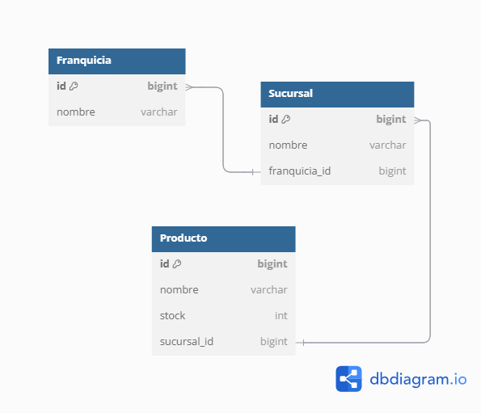

# Franquicias Application

## Prueba Tecnica
API para manejar una lista de franquicias. Una franquicia se
compone por un nombre y un listado de sucursales y, a su vez, una sucursal está
compuesta por un nombre y un listado de productos ofertados en la sucursal. Un producto
se componente de un nombre y una cantidad de stock.

## Diagrama Relacional



## Endpoints

### Franquicia Endpoints
- **GET /franquicias**: Retorna todas las sucursales.
- **GET /franquicias/{id}**: Retorna una franquicia por su ID.
- **POST /franquicias**: Crea una nueva franquicia.
- **DELETE /franquicias/{id}**: Elimina una franquicia por ID.
- **PUT /franquicias/{id}/nombre**: Edita el nombre de una franquicia por su ID.

### Sucursal Endpoints
- **POST /franquicias/{id}/sucursales**: Añade una sucursal a una franquicia.
- **PUT /franquicias/{franquiciaId}/sucursales/{sucursalId}/nombre**: Edita el nombre de una sucursal.

### Producto Endpoints
- **POST /franquicias/{franquiciaId}/sucursales/{sucursalId}/productos**: Añade un producto a una sucursal
- **DELETE /franquicias/{franquiciaId}/sucursales/{sucursalId}/productos/{productoId}**: Elimina un producto de una sucursal.
- **PUT /franquicias/{franquiciaId}/sucursales/{sucursalId}/productos/{productoId}/stock**: Actualiza el stock de un producto.
- **PUT /franquicias/{franquiciaId}/sucursales/{sucursalId}/productos/{productoId}/nombre**: Actualiza el nombre de un producto.
- **GET /franquicias/{id}/productos-con-mas-stock**: Retorna los productos con más stock por franquicia

## Modelos

### Franquicia

- `id`: Long
- `name`: String
- `address`: String
- `sucursales`: List<Sucursal>

### Sucursal

- `id`: Long
- `name`: String
- `address`: String
- `productos`: List<Producto>

### Producto
- `id`: Long
- `name`: String
- `price`: Double
- `stock`: int

## Getting Started

### Pre-requisitos
- Java 11 or higher
- Maven
- PostgreSQL
- Docker

### Ejecutar la aplicación
1. Clonar el repositorio:
   ```bash
   git clone https://github.com/j-fernando-c/franquicias-api.git
   ```
2. navegar al proyecto:
   ```bash
   cd franquicias
   ```
3. Build del proyecto:
   ```bash
   mvn clean install
   ```
4. Ejecuta la aplicación:
   ```bash
   mvn spring-boot:run
   ```

### Ejecutar la aplicación con el perfil `prod`

1. Clonar el repositorio:
   ```bash
   git clone https://github.com/j-fernando-c/franquicias-api.git
   ```
2. Navegar al proyecto:
   ```bash
   cd franquicias
   ```
3. Build del proyecto:
   ```bash
   mvn clean install
   ```
4. Ejecutar la aplicación con el perfil `prod`:
   ```bash
   mvn spring-boot:run -Dspring-boot.run.profiles=prod
   ```

### Ejecutar la aplicación con el perfil `local`

1. Clonar el repositorio:
   ```bash
   git clone https://github.com/j-fernando-c/franquicias-api.git
   ```
2. Navegar al proyecto:
   ```bash
   cd franquicias
   ```
3. Build del proyecto:
   ```bash
   mvn clean install
   ```
4. Ejecutar la aplicación con el perfil `local`:
   ```bash
   mvn spring-boot:run -Dspring-boot.run.profiles=local
   ```

## Flujo de Trabajo con Docker

### Crear imagen de Docker

   ```bash
   docker build -t jfernandoc/franquicias-api:latest .
   ```

### Correr el contenedor de Docker

   ```bash
   docker run -p 8080:8080 jfernandoc/franquicias-api
   ```

### Desplegar imagen en Docker Hub

1. Iniciar sesión en Docker Hub:
   ```bash
   docker login
   ```
2. Etiquetar la imagen:
   ```bash
   docker tag franquicias-api jfernandoc/franquicias-api:latest
   ```
3. Subir la imagen:
   ```bash
   docker push your-dockerhub-username/franquicias-api:latest
   ```

### Usar la imagen desde Docker Hub

1. Descargar la imagen:
   ```bash
   docker pull jfernandoc/franquicias-api
   ```
2. Correr el contenedor:
   ```bash
   docker run -p 8080:8080 jfernandoc/franquicias-api:latest
   ```
